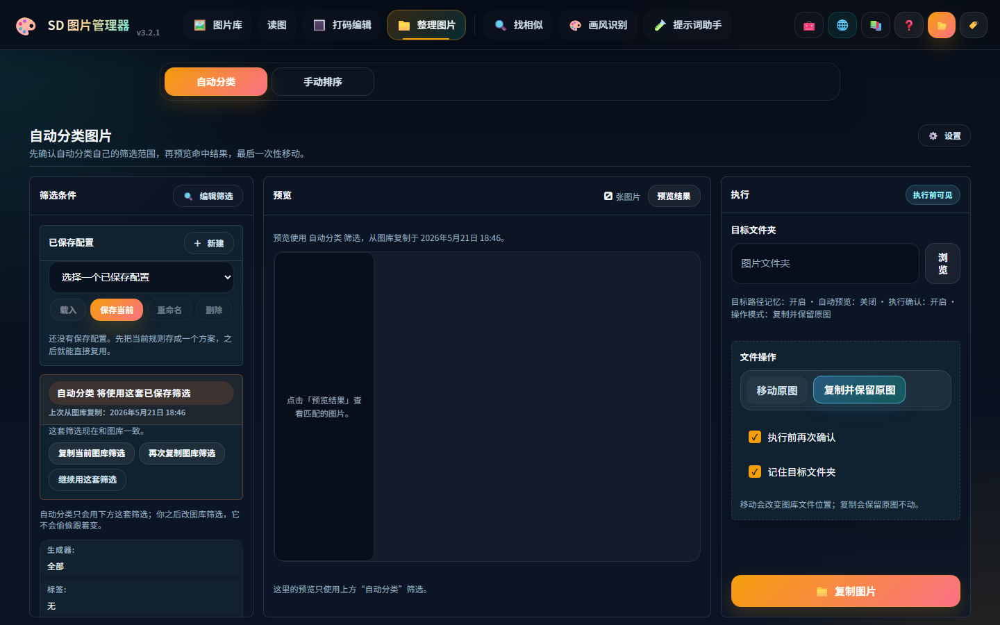
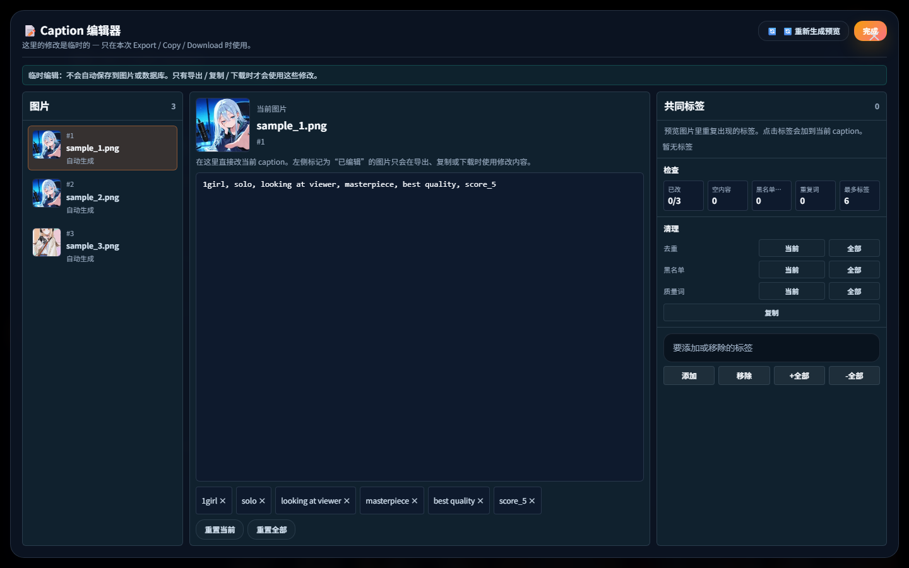
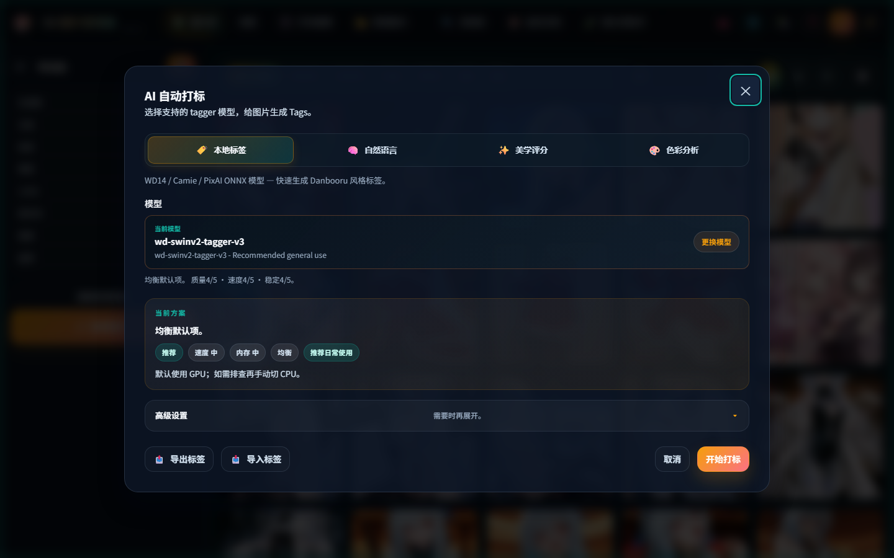
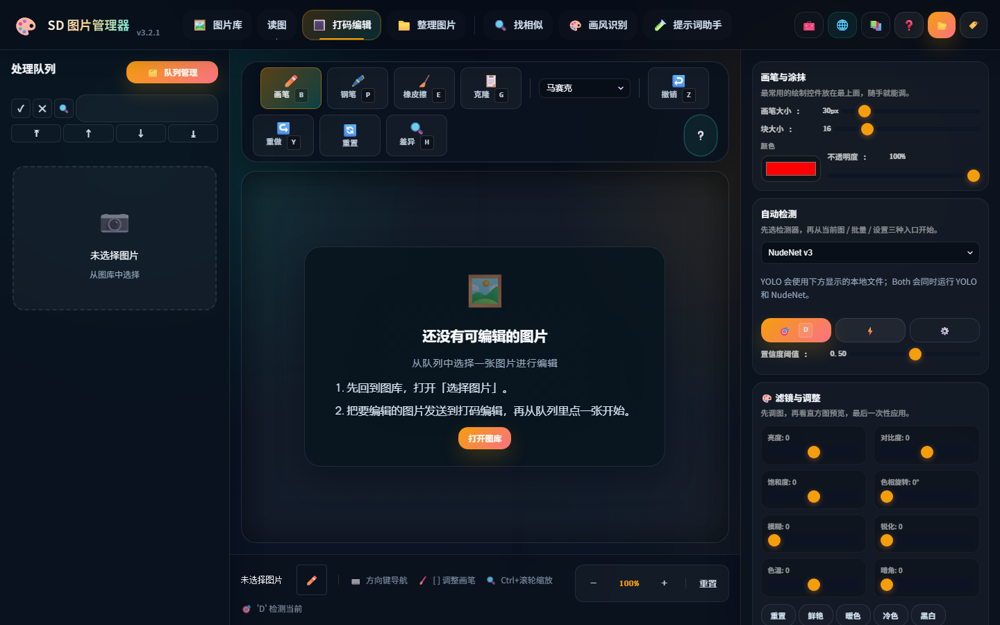
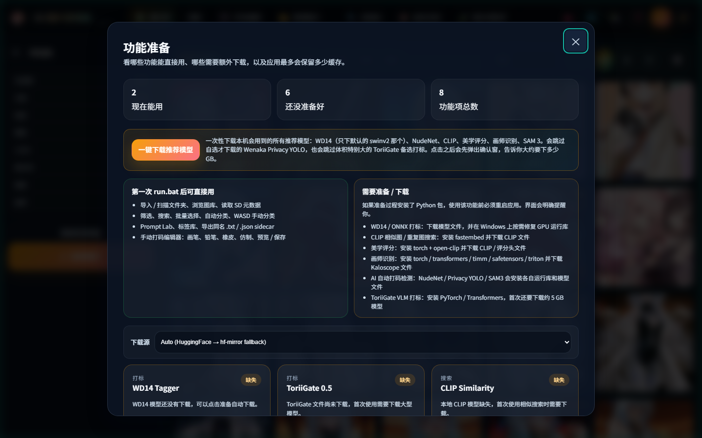
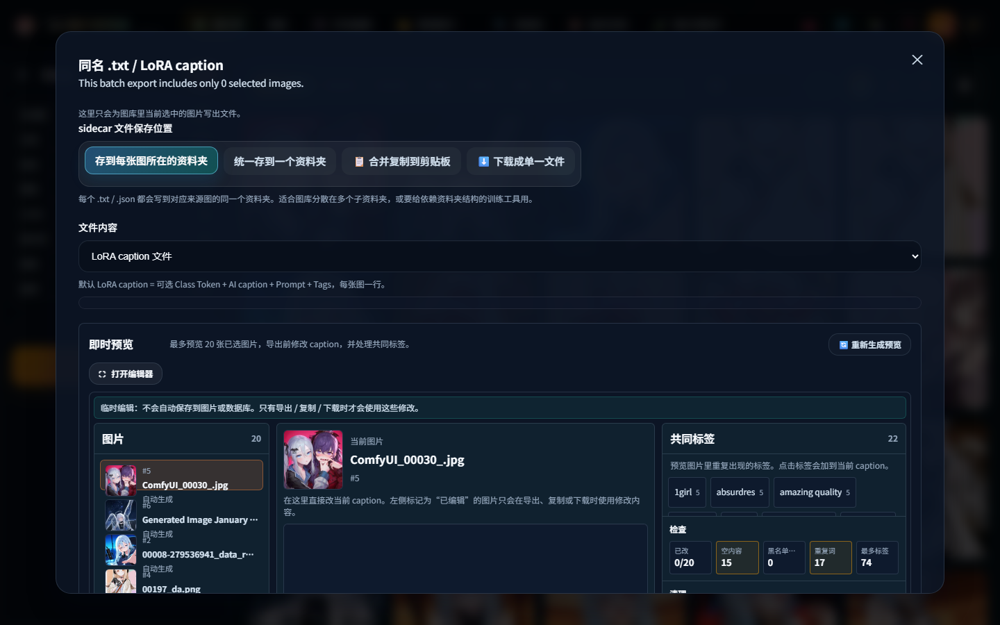
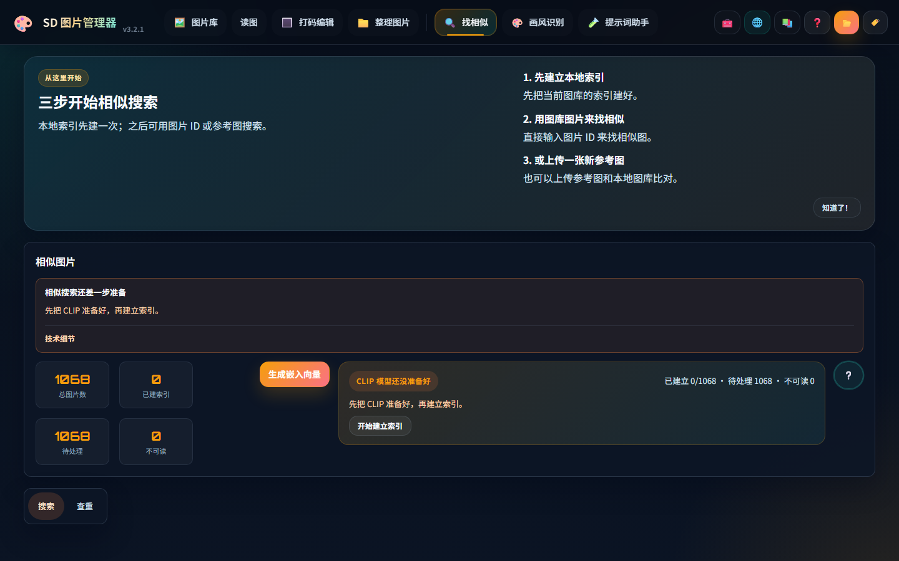
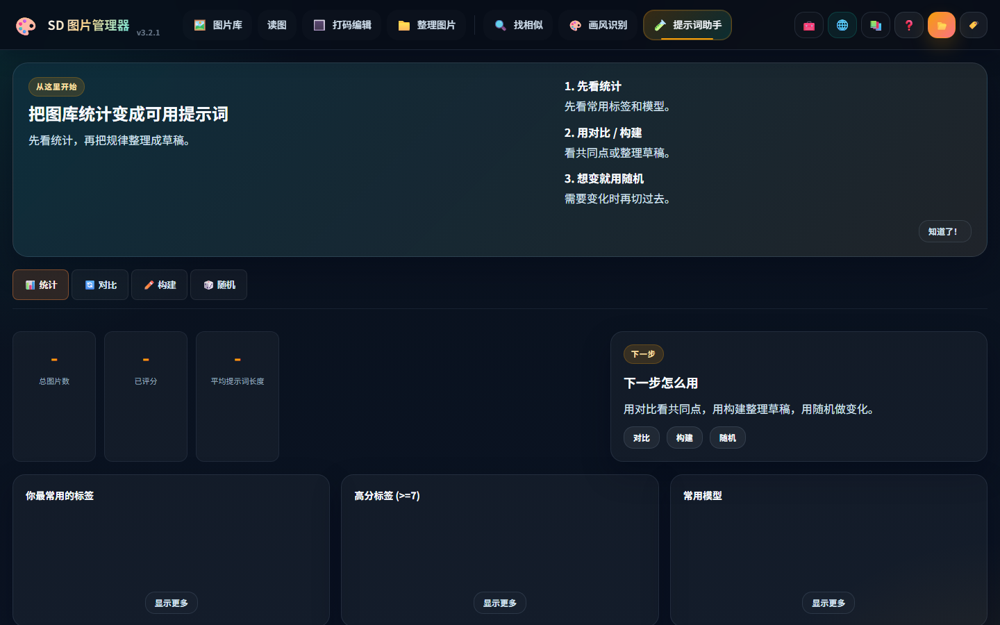

# SD Image Sorter

<p align="center">
  <b>Local-first AI image command center for Stable Diffusion creators.</b>
</p>

<p align="center">
  扫图库、读参数、自动打标、WASD 狂飙分拣、相似图查重、AI 打码修图，全都在你自己的电脑上完成。
</p>

<p align="center">
  <a href="#zh-cn">简体中文</a>
  ·
  <a href="#english">English</a>
</p>

<p align="center">
  
  
  
  
</p>

<p align="center">
  <a href="https://github.com/peter119lee/sd-image-sorter/releases/latest/download/sd-image-sorter-v3.4.3-windows-portable.zip"><b>Download for Windows</b></a>
  ·
  <a href="https://github.com/peter119lee/sd-image-sorter/releases/latest/download/sd-image-sorter-v3.4.3-linux-portable-x86_64.tar.gz"><b>Linux x86_64 (portable)</b></a>
  ·
  <a href="https://github.com/peter119lee/sd-image-sorter/releases/latest/download/sd-image-sorter-v3.4.3-linux-portable-aarch64.tar.gz"><b>Linux aarch64 (portable)</b></a>
  ·
  <a href="https://github.com/peter119lee/sd-image-sorter/releases/latest/download/sd-image-sorter-v3.4.3-linux.tar.gz">Linux (source)</a>
  ·
  <a href="#quick-start">Quick Start</a>
</p>

<p align="center">
  
</p>

> [!IMPORTANT]
> This is a local-only app. Your images stay on your machine. Models run locally. No cloud upload, no account, no nonsense.

<a name="zh-cn"></a>

## 简体中文

> 你说得对，但这就是 **SD Image Sorter**🤚。能扫几千张 SD 图👌，能自动识别 ComfyUI / NovelAI / WebUI / Forge 元数据✌️，能把 prompt、negative prompt、checkpoint、LoRA、VAE、seed 一口气全扒出来🤙。有 Gallery 管图库✊，有 Image Reader 拖图即读👍，有 WD14 AI 打标👈，有分级和后台批处理👐，有 Auto-Separate 一键搬运🙌，还有 WASD 手动狂飙分拣😨。然后还有 CLIP 相似图查重😰，还有 Prompt Lab 反炼提示词😭，还有 Artist Identification 认风格🖐️，还有 Image Obfuscate 加扰解扰🤚，还有 Aesthetic Score 本地打分😵。然后 Censor Edit 还能 YOLO 自动检测👊🏿😭👊🏿，还能手动画笔、马赛克、高斯模糊、黑白条、批量保存🖐️😭🤚。Reader、Tagger、Sorter、Similarity、Prompt Lab、Artist ID、Obfuscate、Aesthetic、Censor 一套全开，文件夹就啊啊啊啊啊啊。

### 一句话宣传

**SD Image Sorter：把“AI 图满盘爆炸、参数到处失踪、好图根本挑不出来、发出去前还得重新打码”的崩溃现场，硬生生压成“扫描、读取、打标、分拣、查重、炼词、识别、打码、加扰、评分”一套打完的本地工作流。**

### 为什么选 SD Image Sorter？

**SD Image Sorter — 唯一为 AI 画师打造的图片管理工具**

通用图片管理器把 AI 生成图当照片处理，SD Image Sorter 从零开始为 Stable Diffusion 工作流设计。它理解你的元数据，说你的语言，提供匹配 AI 画师实际工作方式的工具。

### 核心差异化

| 对比维度 | SD Image Sorter | Allusion | TagStudio | DigiKam | Hydrus |
|---------|----------------|----------|-----------|---------|--------|
| **SD 元数据** | 原生支持 ComfyUI/NAI/WebUI/Forge | ❌ | ❌ | ❌ | ❌ |
| **AI 自动打标** | WD14 全家桶（7 个模型） | ❌ | ❌ | 仅人脸识别 | 需插件 |
| **VLM 描述** | 5 厂商 + Ollama | ❌ | ❌ | ❌ | ❌ |
| **CLIP 相似搜索** | ✅ | ❌ | ❌ | ❌ | ✅（第三方） |
| **键盘分拣** | WASD 四向 + 多模式 | ❌ | ❌ | ❌ | ❌ |
| **打码工具** | YOLO + 画笔 + 批处理 | ❌ | ❌ | ❌ | ❌ |
| **Prompt Lab** | ✅ 反推提示词 | ❌ | ❌ | ❌ | ❌ |
| **LoRA 导出** | 模板引擎 + 预设 | ❌ | ❌ | ❌ | ❌ |
| **部署方式** | 单文件便携版 | 安装程序 | 需要 Python | 完整 KDE 栈 | 复杂设置 |
| **学习曲线** | 低-中 | 低 | 中 | 中 | 高 |

详见 [Why Choose Us](docs/WHY_CHOOSE_US.md) 完整对比。

### 它到底解决什么问题

如果你也经历过这些破事，这个工具就是给你做的：

- 图很多，但根本想不起哪张是哪个模型、哪组提示词生成的
- 想把 `best / keep / delete / explicit` 分桶，结果手工拖文件拖到怀疑人生
- 想批量打标签、查重、找相似图、做隐私打码，却要开一堆零碎脚本和网站
- 想快速回看一张图的 SD 参数，但不想先导入一整个图库

### 为什么这个仓库值得点 Star

- **真本地**：浏览器只是界面，核心在本机跑，图片不上传。
- **真懂 SD 图**：能读 ComfyUI、NovelAI、WebUI / A1111、Forge 等常见元数据。
- **真能干活**：不是只看图，是完整的筛选、打标、排序、查重、打码工作流。
- **真适合大图库**：几千张图不是展示案例，是默认使用场景。
- **真有速度感**：WASD 手动分拣、批量动作、后台进度、快捷键都不是摆设。
- **真有界面**：不是冷冰冰的调试页，而是带玻璃拟态和霓虹氛围的本地工具。

## 截图

<p align="center">
  
</p>

<p align="center">
  
  
</p>

<p align="center">
  
  
</p>

<p align="center">
  
  
</p>

<p align="center">
  
  
</p>

<p align="center">
  
  
  
</p>

## 核心功能

### 1. Gallery 画廊

- 扫描任意文件夹，建立本地图库
- 自动识别生成器：ComfyUI、NovelAI、WebUI / A1111、Forge
- 提取 prompt、negative prompt、steps、CFG、seed、checkpoint、LoRA、VAE、尺寸等信息
- 按生成器、标签、评级、模型、LoRA、提示词关键字、尺寸、长宽比筛选
- 按时间、文件名、提示词长度、标签数量等排序
- **Library Roots 与文件夹树**：定义多个库根目录，侧边栏文件夹树导航，按路径筛选

### 2. AI Tagging 打标

- 内置 WD14 系列标签模型，支持批量自动打标
- 支持 general / character 双阈值
- 自动判定 General / Sensitive / Questionable / Explicit
- 支持 EVA02、SwinV2、ConvNeXt、ViT、Camie、PixAI、ToriiGate 等模型
- 后台持续打标，右下角进度跟踪，不会卡死整个界面
- **后台任务队列**：统一管理 tagging、相似度、美学评分、画师识别等任务，实时进度跟踪

### 3. Sorting 排序

- **Auto-Separate**：按筛选条件一键批量移动
- **Manual Sort 多模式**：
  - **Slot Mode**（槽位模式）：`W / A / S / D` 四路分拣，`Space` 跳过，`Z` 撤销
  - **Bracket Mode**（锦标赛模式）：两两对比排名，适合精选最佳作品
  - **Cull Mode**（剔除模式）：保留 / 删除二分，快速清理低质量图片
- 适合把收藏、精选、待删、NSFW、角色分类等工作压缩成几分钟

### 4. Collections 整理

- 将图片组织到持久化的命名集合中
- 按集合筛选，批量添加 / 移除
- 集合感知的导航与管理

### 5. Star Ratings 星级评分

- 1-5 星评分系统，gallery 网格中可见
- 按最小 / 最大星级筛选
- 批量设置星级

### 6. Censor Edit 打码编辑

- YOLO / NudeNet / SAM3 自动检测敏感区域
- 支持马赛克、高斯模糊、黑条、白条
- 画笔、铅笔、橡皮、仿制图章一套齐
- 队列式批量处理，适合做分享版、公开版、平台版素材

### 7. Similar Images 相似图

- 基于 CLIP embedding 做视觉相似度搜索
- 找近似重复图
- 用库内图片搜相似图
- 用外部图片搜图库里的相似结果

### 8. Prompt Lab 提示词工坊

- 从你自己的图库标签反推可复用 prompt
- 自动处理部分互斥标签
- 内置标签套装和负向 prompt 生成
- 对小图库也有兜底标签池

### 9. 其他实用模块

- **Artist Identification**：实验性画师 / 风格识别
- **Image Reader**：拖放或选择原始 PNG，立刻读参数，不用先扫描图库；剪贴板图片会明确提示可能丢失 SD metadata
- **Image Obfuscate**：图片加扰 / 解扰，适合带密码分享
- **Aesthetic Score**：本地美学评分

### 10. VLM 自然语言打标

- 多厂商 VLM 打标：OpenAI / Anthropic / Gemini / Vertex AI / Ollama
- 一键部署本地 Ollama 视觉模型（Gemma 3、Qwen 2.5 VL、MiniCPM-V 等）
- 5 个 LoRA 训练 prompt preset（通用 NL、Anima 详细、短句、角色 LoRA、NSFW 兼容）
- VLM 也能输出 danbooru 结构化标签
- 支持 HTTP / HTTPS / SOCKS 代理

### 11. LoRA 训练导出

- 模板引擎：7 个内建 preset（Anima、Illustrious/Pony、NoobAI、FLUX、Kohya、自定义）
- 14 个模板变量：`{trigger}`、`{tags}`、`{nl_caption}`、`{rating}`、`{count}` 等
- Caption Editor 工作台（三栏：图片队列 / 编辑器 / 共同标签工具）
- 全屏专用编辑模式
- 下划线转空格（保留 `score_*`），可手动关闭
- 导出前 Live Preview

### 12. 色彩分析

- 提取主色、亮度、饱和度、色温
- 按亮度 / 饱和度 / 亮度偏度排序
- 按色温 / 亮度区间 / 分布形状筛选
- 直方图形状分类（线稿 vs 照片）

### 13. 批量标签编辑器

- 全库批量查找替换、添加、移除标签
- 操作前预览影响范围

### 14. Reader 元数据编辑

- 编辑 prompt / negative / seed / sampler / steps / CFG / model / LoRA
- 另存为新图（PNG / WebP / JPG）
- 同路径覆盖需二次确认

## 这工具最适合谁

- Stable Diffusion / NovelAI / ComfyUI 重度用户
- 有几千到几万张图，已经开始找不到图的人
- 想把“生成”变成“可检索资产管理”的人
- 想把分拣、筛选、打码、查重流程尽量压在一个本地工具里的人

## 60 秒上手

### Windows

1. 下载 [sd-image-sorter-v3.4.3-windows-portable.zip](https://github.com/peter119lee/sd-image-sorter/releases/latest/download/sd-image-sorter-v3.4.3-windows-portable.zip)
2. 解压到任意目录
3. 双击 `run-portable.bat`
4. 浏览器会自动打开 `http://localhost:8487`
5. 首次使用请点击右上角 **Setup Now** 下载所需的 AI 模型

### Linux

**便携版（推荐，无需系统 Python）：**

按 CPU 架构挑一个：

- **x86_64**（一般 PC、Intel/AMD 桌面/笔电、Steam Deck、传统 x86 服务器）
  下载 [sd-image-sorter-v3.4.3-linux-portable-x86_64.tar.gz](https://github.com/peter119lee/sd-image-sorter/releases/latest/download/sd-image-sorter-v3.4.3-linux-portable-x86_64.tar.gz)（约 80 MB）
- **aarch64 / arm64**（Raspberry Pi 4 / 5、ARM Linux 服务器、AWS Graviton、Apple Silicon 在 Linux 下）
  下载 [sd-image-sorter-v3.4.3-linux-portable-aarch64.tar.gz](https://github.com/peter119lee/sd-image-sorter/releases/latest/download/sd-image-sorter-v3.4.3-linux-portable-aarch64.tar.gz)（约 75 MB）

解压并执行（指令一样，看你下哪个 tarball）：

```bash
# 例如 x86_64
tar xzf sd-image-sorter-v3.4.3-linux-portable-x86_64.tar.gz
cd sd-image-sorter
chmod +x run-portable.sh
./run-portable.sh
```

适用于任何 Linux 发行版（包括系统 Python 是 3.14、或没装 Python 的情况）。两个架构都内置 cpython 3.13.13。

**源码版（需要自己装 Python 3.12+）：**

1. 下载 [sd-image-sorter-v3.4.3-linux.tar.gz](https://github.com/peter119lee/sd-image-sorter/releases/latest/download/sd-image-sorter-v3.4.3-linux.tar.gz)
2. 解压并执行：

```bash
tar xzf sd-image-sorter-v3.4.3-linux.tar.gz
cd sd-image-sorter
chmod +x run.sh
./run.sh
```

### 从源码运行

```bash
git clone https://github.com/peter119lee/sd-image-sorter.git
cd sd-image-sorter
# Windows
run.bat

# Linux / macOS
./run.sh
```

默认会在 `http://127.0.0.1:8487` 启动（可通过 `SD_IMAGE_SORTER_PORT` 覆盖）。

> [!TIP]
> macOS 用户直接用 `./run.sh` 即可。脚本会自动创建 Python venv 并安装依赖。Apple Silicon (M1/M2/M3/M4) 和 Intel Mac 均支持，AI 推理走 CPU（ONNX Runtime 自动选择最优 provider）。

> [!TIP]
> Windows 便携版自带 Python 3.12。源码 / Linux 用户只要装 Python 3.12 或 3.13 都可以——v3.2.2 起 lockfile 同时锁了两个版本（3.12 走 numpy 1.x，3.13 走 numpy 2.x）。默认只安装轻量核心依赖；CLIP / NudeNet / YOLO / SAM3 / 美学评分 / 画师识别等重型 AI 运行库会在你点击 Feature Setup 的 Prepare / Download 后按需安装。若界面提示已安装 Python 包，请重启应用后再使用该功能。

## 下载与运行说明


### 首次启动能直接用什么？什么需要下载 / 重启？

| 状态 | 功能 | 说明 |
|:--|:--|:--|
| 第一次 `run.bat` 后直接可用 | 扫描 / 导入图库、浏览、筛选、搜索、批量选择、自动分类、WASD 手动分类、Prompt Lab、元数据读取、手动打码编辑器、导出同名 sidecar | 只依赖轻量核心包；不会主动拉 Torch / SAM3 / NudeNet / Ultralytics / FastEmbed。 |
| 需要下载模型文件，但不需要额外 Python 包 | WD14 / Camie / PixAI ONNX 打标 | 点击 **功能准备 / Prepare** 或首次打标时下载模型文件；ONNX Runtime 已在核心依赖里。 |
| 需要 Prepare / Download，可能要求重启 | CLIP 相似搜索、美学评分、画师识别、NudeNet、Privacy YOLO、SAM3、ToriiGate | 如果准备过程安装了 Python 包，界面会提示重启；必须重启后再用对应功能。ToriiGate 首次模型约 5 GB，SAM3 / Torch 也会占用较多空间。 |

缩略图缓存默认上限是 **500 MB**。它只删可重新生成的缩略图，不会删原图；你可以在 **功能准备 → 磁盘占用 → 缩略图缓存上限** 改大小，填 `0` 可关闭持久缩略图缓存。界面会提示取舍：上限越低越省磁盘，但大图库滚动时可能更常重建缩略图，CPU / 硬盘 IO 会更忙。

旧用户如果之前已经安装过全量 AI Python 包，可以在 **功能准备 → 磁盘占用 → Python 运行环境** 点击「下次启动重建轻量运行环境」。它只会安排下次启动器启动时重建 Python 运行环境，源码/Linux 版会重建 `backend/venv`，Windows 便携版会清掉嵌入式 Python 的已安装包；不会删除 `data/`、`images.db`、设置、缓存或已下载模型。

### GPU / 运行时说明

- 默认启动走轻量核心依赖，不会主动下载 Torch / SAM3 / NudeNet / Ultralytics / FastEmbed 等重型包
- 需要一次性安装旧的全量 AI 运行库时，可先设置 `SD_IMAGE_SORTER_INSTALL_FULL_AI=1` 再运行启动器
- NVIDIA 显卡在全量模式下会优先使用 `onnxruntime-gpu`
- NVIDIA 全量模式首次启动如果停在 `Checking Windows ONNX Runtime package state...`，可能是在补 CUDA / cuDNN 运行库；新版会显示真实 pip 进度，不是死机
- Intel Arc / AMD Radeon 在全量模式下会切到 `onnxruntime-directml`
- 没有合适 GPU 也能 CPU 跑，只是慢一些
- `v3.0.2` 修了 Windows 下部分显卡 VRAM 识别不准导致 batch size 偏保守的问题
- `v3.0.3` 修了 portable launcher 无视 `SD_IMAGE_SORTER_PORT` 打开错误 URL、Civitai 下载 403、艺术家识别诊断接口一直回 `available:false`、ToriiGate 首次下载没有明确 5 GB 提示
- `v3.0.4` 收口了 4 个发布阻塞：Reader 剪贴板图片会明确提示 metadata 可能丢失、`censor-legacy` prepare 改成结构化 `409` 登录墙错误、scan 会隔离 corrupt/truncated 图片、similarity 进度会点名跳过/坏图/失败项
- `v3.0.5` 自动 GPU 安全策略、Censor 侧栏布局、流式扫描、版本同步
- `v3.0.6` ComfyUI 高级工作流 prompt 提取、LoRA 权重显示、VAE/CLIP 提取、aesthetic 冻死修复、JPG/WebP metadata 保留、禁用 LoRA 过滤、Artist ID 进度修复
- `v3.1.0` Reader 可直接编辑 metadata 并另存新图（png/webp/jpg）、同路径覆盖先确认；扫描更早可浏览且后台继续补图/补 metadata；新增「重连遗失文件」流程（图被改名/移动后不用重新导入）；Feature Setup 新增「磁盘占用」面板（tmp / pip 缓存 / 缩略图 / 通用缓存可勾选清理，模型与 HF/Torch runtime 只读保护）；自动分类批量移动/复制可中途取消；美学分数与画师筛选并入排序通道；identify-batch / obfuscation 单次上限提到 5 万、后端 image_ids 上限 500 万；新增 Camie / PixAI tagger；新增 SAM3 Pro 文字 prompt 分割（实验性，建议主打码继续用 NudeNet 或 Wenaka）；修了 Clear gallery ReferenceError、自动移动 0% 卡死、批量打标走批量 DB 查询、相似度死锁正确报错并支持取消、手动分类撤销失败回滚 session、aesthetic 停止后分数不再消失、Windows 第一次启动 CUDA wheel 不再被旧的 CPU torch 误导、WSL/Linux 下旧 Windows 路径（`L:\...`）图库不再丢缩略图；SAM3 后端从 `sam3==0.1.3` 换到 `transformers.Sam3Model`，Portable 内建 Python 升到 3.12.8；`file://` 协议模型下载默认拒绝（除非显式打开测试旗标）；跨平台 lockfile 哈希修好，CI 在 Linux + Windows 双平台全套通过

### 无法访问 HuggingFace？

打开 **Setup Now**（模型管理器），顶部有 **Download Source** 下拉选单：

- **Auto** — 先试 HuggingFace，失败自动走 hf-mirror.com
- **hf-mirror.com** — HuggingFace 镜像
- **ModelScope** — 魔搭社区（Artist ID、SAM3 支持）

设置会保存，重启后生效。不需要编辑任何配置文件。

## 快捷键

| 场景 | 按键 | 动作 |
|:--|:--|:--|
| Manual Sort | `W` `A` `S` `D` | 移动到 4 个目标文件夹 |
| Manual Sort | `Space` | 跳过当前图片 |
| Manual Sort | `Z` | 撤销上一步 |
| Censor Edit | `A` / `D` | 上一张 / 下一张 |
| Censor Edit | `B` `P` `E` `G` | 画笔 / 铅笔 / 橡皮 / 仿制 |
| Censor Edit | `[` `]` | 调整笔刷大小 |
| Censor Edit | `Ctrl+Z` | 撤销笔触 |
| Censor Edit | `Ctrl + 滚轮` | 缩放画布 |

<details>
<summary><b>支持的元数据来源</b></summary>

- ComfyUI：PNG `prompt` / `workflow` JSON
- NovelAI：PNG `Comment` JSON
- WebUI / A1111：PNG `parameters`
- Forge：兼容 WebUI 参数串
- WebP：EXIF / XMP 中的 SD 元数据

</details>

<details>
<summary><b>硬件建议</b></summary>

| 功能 | 内存 | GPU |
|:--|:--|:--|
| Gallery / Filters / Sort / Prompt Lab | 4 GB | 可无 |
| WD14 打标（SwinV2 / ConvNeXt / ViT） | 8 GB | 可选 |
| WD14 打标（EVA02 / Camie / PixAI） | 16 GB | 建议 |
| ToriiGate 多模态打标 | 24 GB | 强烈建议 CUDA |
| Censor Detection | 8 GB | 可选 |
| Similar Images | 8 GB | 可无 |
| Artist ID | 16 GB | 建议 |
| SAM3 精修 | 16 GB | 必须 CUDA |

</details>

<details>
<summary><b>Tagger Runtime Chunk 规则（当前实际生效）</b></summary>

> 这些规则是后端最终会执行的安全上限，不只是界面提示。
> 就算用户手动把 chunk 调大，后端也会按模型类型 + 当前可用 VRAM / RAM 把它压回安全范围。

### 1. 模型分级

| 分级 | 模型 |
|:--|:--|
| 轻量 | `wd-vit-tagger-v3` |
| 均衡 | `wd-swinv2-tagger-v3` / `wd-convnext-tagger-v3` / `wd-vit-large-tagger-v3` |
| 重型 | `wd-eva02-large-tagger-v3` / `camie-tagger-v2` / `pixai-tagger-v0.9` |
| VLM | `toriigate-0.5` |
| 自定义 ONNX | `custom` |

### 2. GPU 规则

#### 轻量 / 均衡 / 自定义 ONNX

| 当前可用 / 总显存 | 最大 chunk |
|:--|:--|
| 可用显存 `< 2.5 GB` | `2` |
| 总显存 `< 4 GB` | `4` |
| 总显存 `< 8 GB` | `8` |
| 总显存 `< 12 GB` | `12` |
| 总显存 `< 16 GB` | `16` |
| 总显存 `< 24 GB` | `24` |
| 总显存 `>= 24 GB` | `32` |

#### 重型模型

| 当前可用显存 | 最大 chunk |
|:--|:--|
| `< 4 GB` | `2` |
| `< 8 GB` | `4` |
| `< 12 GB` | `6` |
| `< 16 GB` | `8` |
| `< 24 GB` | `12` |
| `>= 24 GB` | `16` |

#### ToriiGate

| 模型 | 最大 chunk |
|:--|:--|
| `toriigate-0.5` | 永远固定 `1` |

说明：
- `ToriiGate` 不是 WD14 ONNX 模型，而是多模态 VLM。它的风险等级明显更高，所以现在强制 `chunk = 1`。
- 之前 UI 里如果出现过 `32` 之类的值，那只是旧的通用显示逻辑，不代表 `ToriiGate` 真会按 32 跑。

### 3. CPU 规则

#### 轻量 / 均衡 / 自定义 ONNX

| 当前可用内存 | 最大 chunk |
|:--|:--|
| `< 8 GB` | `4` |
| `< 12 GB` | `6` |
| `< 20 GB` | `10` |
| `< 32 GB` | `14` |
| `>= 32 GB` | `18` |

#### 重型模型

| 当前可用内存 | 最大 chunk |
|:--|:--|
| `< 8 GB` | `2` |
| `< 12 GB` | `4` |
| `< 20 GB` | `6` |
| `< 32 GB` | `8` |
| `>= 32 GB` | `10` |

#### ToriiGate

| 模型 | 最大 chunk |
|:--|:--|
| `toriigate-0.5` | 永远固定 `1` |

### 4. 自定义 ONNX 模型怎么选

自定义模型的结构和显存占用仍可能和内建模型不同，所以 Custom 路径默认用保守 chunk 起步；只有你在高级选项里手动改 batch size，才会按硬件推荐上限尝试更大的值。

`Custom Local Model` 不是盲跑入口；它现在有 **Custom Model Type**。本地 WD14-like / PixAI / Camie ONNX 都可以走 Custom，但必须选对 profile：WD14/PixAI 使用 `selected_tags.csv`，Camie 使用 metadata JSON。metadata 路径可不填，只要对应文件放在模型旁边；如果你显式填写 model / metadata 路径，文件必须真实存在。应用只按所选 profile 自动发现匹配格式，且不会删除或重下载你提供的本地 ONNX。应用会按 profile 套用对应预处理、metadata 解析、置信度归一化和 rating fallback。ToriiGate 不是 ONNX tagger，它走 VLM/PyTorch 后端；请继续使用内建 ToriiGate 项，不能伪装成 Custom ONNX。

标签阈值只按已经归一化到 `[0, 1]` 的 confidence 执行：WD/PixAI 直接使用概率；Camie 的 logits 会先 sigmoid；异常的 NaN/Inf/越界分数会被忽略，避免把无效 logits 当成高置信标签。ToriiGate 是 VLM 生成标签，不使用 WD14 阈值。

建议做法：

1. 先看系统推荐的 chunk 值
2. 把这个推荐值当成你这台机器的“最高尝试值”
3. 第一次跑自定义模型时，先从 `1` 或较小值开始
4. 如果稳定，再往上加；一旦不稳，就退回上一个值

如果你只想记一句话：

- **自定义 ONNX 的最大可选 chunk = 你当前硬件推荐值**
- **重型内置模型会比这个更保守**
- **ToriiGate 永远是 1**

</details>

<details>
<summary><b>模型体积（首次使用自动下载）</b></summary>

| 模型 | 大小 | 用途 |
|:--|:--|:--|
| wd-swinv2-tagger-v3 | ~446 MB | AI 打标默认模型 |
| wd-eva02-large-tagger-v3 | ~1.2 GB | 更高质量打标 |
| camie-tagger-v2 | ~1.3 GB | 更新标签空间 |
| pixai-tagger-v0.9 | ~1.2 GB | 更新标签空间 |
| clip-ViT-B-32-vision | ~335 MB | 相似图搜索 |
| wenaka_yolov8s-seg | ~46 MB | 打码检测 |
| NudeNet 320n | ~12 MB | 打码检测 |
| Kaloscope 2.0 | ~2.8 GB | 画师识别 |
| SAM3 | ~3.3 GB | 打码精修 |
| CLIP ViT-L/14 + aesthetic head | ~400 MB | 美学评分 |

</details>

## 项目结构

```text
sd-image-sorter/
├── backend/            # FastAPI + SQLite + AI model orchestration
├── frontend/           # Vanilla HTML / JS / CSS UI
├── data/               # 运行时状态（images.db、thumbnails、models、state 等）
├── docs/screenshots/   # README 展示图
├── models/             # 发布时附带的基础模型文件（运行时会同步到 data/models）
├── run-portable.bat    # Windows 便携版入口
├── run.bat             # Windows 源码运行入口
└── run.sh              # Linux 运行入口
```

## 更多文档

- [CHANGELOG.md](CHANGELOG.md)
- [docs/API.md](docs/API.md)
- [docs/architecture.md](docs/architecture.md)
- [SECURITY.md](SECURITY.md)

## 特别感谢

| 名称 | 贡献 |
|:--|:--|
| [SmilingWolf](https://huggingface.co/SmilingWolf) | WD14 Tagger 系列模型 |
| [Camie](https://huggingface.co/camie-tagger/camie-tagger-v2) | Camie Tagger v2 模型 |
| [PixAI](https://huggingface.co/PixAI-Tagger/PixAI-Tagger-v0.9) | PixAI Tagger v0.9 模型 |
| [ToriiGate](https://huggingface.co/Minthy/ToriiGate-0.5) | ToriiGate 多模态 VLM Tagger |
| [Wenaka2004](https://github.com/Wenaka2004/auto-censor) | 自动打码思路与 YOLO 隐私检测模型 |
| [NudeNet](https://github.com/notAI-tech/NudeNet) | NudeNet NSFW 检测模型 |
| [SAM3 / Segment Anything](https://github.com/facebookresearch/sam2) | SAM3 文本引导分割精修 |
| [Spawner1145](https://github.com/spawner1145/comfyui-lsnet)、DraconicDragon、[heathcliff01](https://www.modelscope.cn/models/Heathcliff02/Kaloscope-2.0/summary) | LSNet / Kaloscope 画师识别模型 |
| [LAION](https://github.com/LAION-AI/aesthetic-predictor) | Aesthetic Score 美学评分模型 |
| [OpenCLIP](https://github.com/mlfoundations/open_clip) | CLIP ViT-L/14 相似图搜索 |
| [Receyuki](https://github.com/receyuki/stable-diffusion-prompt-reader) | Prompt Reader 方向启发 |
| [大番茄图片混淆](https://dfqtphx.netlify.app/) | 图片混淆 Hilbert 曲线方案 |
| [小番茄图片隐藏](https://singularpoint.cn/hideImg1.html) | 图片隐藏兼容方案 |
| [OpenAI](https://openai.com) / [Anthropic](https://anthropic.com) / [Google Gemini](https://ai.google.dev) / [Ollama](https://ollama.com) | VLM captioning providers & 本地运行时 |
| [zanllp/infinite-image-browsing](https://github.com/zanllp/sd-webui-infinite-image-browsing) | 图库浏览 + 元数据搜索灵感来源 |
| [starik222/BooruDatasetTagManager](https://github.com/starik222/BooruDatasetTagManager) | Caption Editor 三栏工作台设计参考 |
| [Tera-Dark/Tag-Master](https://github.com/Tera-Dark/Tag-Master) | Booru 标签管理 + 自动补全 UX 参考 |
| [n0va39/ComfyUI-EXIF-viewer](https://github.com/n0va39/ComfyUI-EXIF-viewer) | ComfyUI workflow prompt 推测和 Civitai resources 提取的实现参考 |

License: [MIT](LICENSE)

---

<a name="english"></a>

## English

**SD Image Sorter** is a local-first web app for people who generate too many Stable Diffusion images and are tired of losing track of them.

It scans folders, reads SD metadata, tags images with WD14 models, finds similar images with CLIP, sorts images with keyboard-speed workflows, and provides an AI-assisted censor editor for batch-safe sharing.

### Why SD Image Sorter?

**SD Image Sorter — The Only Image Manager Built for AI Artists**

Unlike general-purpose image managers that treat AI-generated images like photos, SD Image Sorter is designed from the ground up for Stable Diffusion workflows.

#### Key Differentiators

| Feature | SD Image Sorter | Allusion | TagStudio | DigiKam | Hydrus |
|---------|----------------|----------|-----------|---------|--------|
| **SD Metadata** | Native ComfyUI/NAI/WebUI/Forge | ❌ | ❌ | ❌ | ❌ |
| **AI Auto-Tagging** | WD14 family (7 models) | ❌ | ❌ | Face detect only | Via plugins |
| **VLM Captioning** | 5 providers + Ollama | ❌ | ❌ | ❌ | ❌ |
| **CLIP Similarity** | ✅ | ❌ | ❌ | ❌ | ✅ (third-party) |
| **Keyboard Sorting** | WASD 4-way + multi-mode | ❌ | ❌ | ❌ | ❌ |
| **Censor Tools** | YOLO + brush + batch | ❌ | ❌ | ❌ | ❌ |
| **Prompt Lab** | ✅ Reverse-engineer prompts | ❌ | ❌ | ❌ | ❌ |
| **LoRA Export** | Template engine + presets | ❌ | ❌ | ❌ | ❌ |
| **Deployment** | Portable single-file | Installer | Python required | Full KDE stack | Complex setup |
| **Learning Curve** | Low-Medium | Low | Medium | Medium | High |

See [Why Choose Us](docs/WHY_CHOOSE_US.md) for detailed comparison.

### Promo Line

**SD Image Sorter turns “my AI image folder is a landfill” into a fast local workflow for finding, filtering, tagging, sorting, comparing, and cleaning your best shots.**

### Highlights

- **Gallery built for SD workflows**: ComfyUI, NovelAI, WebUI / A1111, Forge metadata support
- **Library Roots & Folder Tree**: Define multiple library root folders, sidebar folder tree navigation
- **AI Tagging**: WD14 family, rating prediction, background jobs, adjustable thresholds
- **Background Job Queue**: Unified queue for tagging, similarity, aesthetic, artist ID with live progress tracking
- **Fast sorting**: Auto-Separate plus addictive `W / A / S / D` manual sorting
- **Manual Sort Multi-Mode**: Slot Mode (4-way), Bracket Mode (tournament ranking), Cull Mode (keep/delete)
- **Collections System**: Organize images into persistent named collections
- **Star Ratings**: 1-5 star rating system visible in gallery grid
- **Censor Edit**: YOLO / NudeNet / SAM3 detection, brush tools, queue workflow, batch save
- **Similar search**: CLIP embeddings for duplicates and near-matches
- **Prompt Lab**: generate reusable prompts from your own library
- **Extra tools**: Artist ID, Image Reader (original file / drag-drop is metadata-safe; clipboard images may lose SD PNG metadata), Image Obfuscate, Aesthetic Score
- **VLM Captioning**: Multi-provider natural language captioning (OpenAI, Anthropic, Gemini, Ollama) with one-click local model deployment
- **LoRA Training Export**: Template engine with 7 presets, 14 variables, Caption Editor workbench (3-pane + full-screen), underscore normalization
- **Color Analysis**: Dominant colors, brightness/saturation sort, color temperature filter, histogram shape classification
- **Mass Tag Editor**: Bulk find/replace, add, remove tags across entire library
- **Reader Metadata Editor**: Edit and save-as-new with format choice (PNG/WebP/JPG)
- **Auto-Separate 3-pane**: Filter editor + preview grid + action sidebar visible at once
- **Caption Editor**: Dedicated full-screen workbench for editing LoRA training captions

### Screenshots

<p align="center">
  
</p>

<p align="center">
  
  
</p>

<p align="center">
  
  
</p>

<p align="center">
  
  
</p>

<p align="center">
  
  
</p>

<p align="center">
  
  
  
</p>

### Quick Start

#### Windows Portable

1. Download [sd-image-sorter-v3.4.3-windows-portable.zip](https://github.com/peter119lee/sd-image-sorter/releases/latest/download/sd-image-sorter-v3.4.3-windows-portable.zip)
2. Extract it anywhere
3. Double-click `run-portable.bat`
4. Your browser opens `http://localhost:8487`
5. First time? Click **Setup Now** (top-right) to download the AI models you need

On NVIDIA machines, first launch may spend extra time at `Checking Windows ONNX Runtime package state...` while installing CUDA / cuDNN runtime wheels. The launcher now shows real pip progress there; it is not frozen.

#### Linux

**Portable (recommended, no system Python needed):**

Pick the right tarball for your CPU:

- **x86_64** — typical PCs, Intel/AMD laptops, Steam Deck, traditional x86 servers. ~80 MB.
- **aarch64 / arm64** — Raspberry Pi 4 / 5, ARM Linux servers, AWS Graviton, Apple Silicon under Linux. ~75 MB.

```bash
# x86_64 example (commands identical for aarch64; just download the matching tarball)
tar xzf sd-image-sorter-v3.4.3-linux-portable-x86_64.tar.gz
cd sd-image-sorter
chmod +x run-portable.sh
./run-portable.sh
```

Works on every modern Linux distro on either architecture, including ones whose system Python is 3.14 or where Python is missing entirely. Both bundles ship cpython 3.13.13.

**Source (bring your own Python 3.12 / 3.13):**

```bash
tar xzf sd-image-sorter-v3.4.3-linux.tar.gz
cd sd-image-sorter
chmod +x run.sh
./run.sh
```

#### From Source

```bash
git clone https://github.com/peter119lee/sd-image-sorter.git
cd sd-image-sorter
./run.sh
```

> [!TIP]
> macOS users can run `./run.sh` directly. The script creates a Python venv and installs dependencies automatically. Both Apple Silicon (M1/M2/M3/M4) and Intel Macs are supported; AI inference runs on CPU (ONNX Runtime auto-selects the optimal provider).


### What Works Immediately vs. What Needs Setup?

| Status | Features | Notes |
|:--|:--|:--|
| Ready after first launch | Scan/import, gallery browsing, metadata reading, filters/search, batch selection, auto-separate, WASD manual sort, Prompt Lab, manual censor editor, sidecar export | Uses only the lightweight core install. It does not pull Torch / SAM3 / NudeNet / Ultralytics / FastEmbed automatically. |
| Needs model files only | WD14 / Camie / PixAI ONNX tagging | Click **Setup Now / Prepare** or start tagging to download model files; ONNX Runtime is already part of core. |
| Needs Prepare / Download and may need restart | CLIP similarity, aesthetic scoring, Artist ID, NudeNet, Privacy YOLO, SAM3, ToriiGate | If Prepare installs Python packages, restart before using that feature. ToriiGate first model download is about 5 GB; SAM3 / Torch can also be large. |

Thumbnail cache is capped at **500 MB** by default. It only removes regeneratable thumbnails, never original images. Change it in **Setup Now → Disk Usage → Thumbnail cache limit**; set `0` to disable persistent thumbnail caching. The UI explains the trade-off: lower limits save disk, but large-gallery scrolling can spend more CPU / disk I/O regenerating thumbnails.

If an old install already pulled full AI Python packages, use **Setup Now → Disk Usage → Python runtime environment → Rebuild lightweight runtime on next start**. It schedules the next launcher start to rebuild only the Python runtime: source/Linux builds recreate `backend/venv`, and Windows portable clears installed packages from embedded Python. `data/`, `images.db`, settings, caches, and downloaded models are kept.

### Tech Stack

- **Backend**: FastAPI, SQLite, Pillow, ONNX Runtime
- **Frontend**: Vanilla HTML, CSS, JavaScript
- **AI models**: WD14 taggers, YOLOv8-based censor detection, CLIP similarity, Kaloscope artist ID
- **Design language**: glassmorphism, neon UI, keyboard-first workflows

### Notes

- Local-only by design
- Models download on first use
- Can't access HuggingFace? Open **Setup Now** and switch **Download Source** to hf-mirror or ModelScope
- See [CHANGELOG.md](CHANGELOG.md) for recent fixes and release history

### Runtime Chunk Rules

The backend enforces the final runtime chunk cap. The UI may show a larger manual choice, but the server will still clamp it to a model-safe limit based on the current machine.

#### Model tiers

| Tier | Models |
|:--|:--|
| Light | `wd-vit-tagger-v3` |
| Balanced | `wd-swinv2-tagger-v3` / `wd-convnext-tagger-v3` / `wd-vit-large-tagger-v3` |
| Heavy | `wd-eva02-large-tagger-v3` / `camie-tagger-v2` / `pixai-tagger-v0.9` |
| VLM | `toriigate-0.5` |
| Custom ONNX | `custom` |

#### GPU caps

Light / balanced / custom ONNX:

| Current free / total VRAM | Max chunk |
|:--|:--|
| Free VRAM `< 2.5 GB` | `2` |
| Total VRAM `< 4 GB` | `4` |
| Total VRAM `< 8 GB` | `8` |
| Total VRAM `< 12 GB` | `12` |
| Total VRAM `< 16 GB` | `16` |
| Total VRAM `< 24 GB` | `24` |
| Total VRAM `>= 24 GB` | `32` |

Heavy models:

| Current free VRAM | Max chunk |
|:--|:--|
| `< 4 GB` | `2` |
| `< 8 GB` | `4` |
| `< 12 GB` | `6` |
| `< 16 GB` | `8` |
| `< 24 GB` | `12` |
| `>= 24 GB` | `16` |

ToriiGate:

| Model | Max chunk |
|:--|:--|
| `toriigate-0.5` | always fixed to `1` |

#### CPU caps

Light / balanced / custom ONNX:

| Current free RAM | Max chunk |
|:--|:--|
| `< 8 GB` | `4` |
| `< 12 GB` | `6` |
| `< 20 GB` | `10` |
| `< 32 GB` | `14` |
| `>= 32 GB` | `18` |

Heavy models:

| Current free RAM | Max chunk |
|:--|:--|
| `< 8 GB` | `2` |
| `< 12 GB` | `4` |
| `< 20 GB` | `6` |
| `< 32 GB` | `8` |
| `>= 32 GB` | `10` |

ToriiGate:

| Model | Max chunk |
|:--|:--|
| `toriigate-0.5` | always fixed to `1` |

#### Custom ONNX guidance

Custom ONNX models still may not match the exact memory profile of their built-in source, so the Custom path starts with a conservative chunk by default. Only a user-edited advanced batch size attempts the larger hardware-recommended limit.

`Custom Local Model` is not a blind runner anymore; it now has a **Custom Model Type**. Local WD14-like, PixAI, and Camie ONNX files can use Custom when the matching profile is selected: WD14/PixAI use `selected_tags.csv`, while Camie uses its metadata JSON. The metadata path is optional when the matching file sits next to the model; if you explicitly enter a model or metadata path, that file must exist. The app only auto-discovers files that match the selected profile, and it never deletes or re-downloads a user-supplied local ONNX. The selected profile controls preprocessing, metadata parsing, confidence normalization, and rating fallback. ToriiGate is not an ONNX tagger; it uses the VLM/PyTorch backend, so keep using the built-in ToriiGate entry instead of pretending it is Custom ONNX.

Tag thresholds are applied only to confidence scores normalized to `[0, 1]`: WD/PixAI use probabilities directly; Camie logits are sigmoid-normalized first; invalid NaN/Inf/out-of-range scores are ignored so bad logits cannot become high-confidence random tags. ToriiGate is VLM-generated and does not use WD14 thresholds.

Practical rule:

1. Start from `1` or another small value
2. Increase only after one stable run
3. Do not go above the current hardware recommendation
4. If it becomes unstable, go back to the previous value

### Credits

| Name | Contribution |
|:--|:--|
| [SmilingWolf](https://huggingface.co/SmilingWolf) | WD14 Tagger models |
| [Camie](https://huggingface.co/camie-tagger/camie-tagger-v2) | Camie Tagger v2 model |
| [PixAI](https://huggingface.co/PixAI-Tagger/PixAI-Tagger-v0.9) | PixAI Tagger v0.9 model |
| [ToriiGate](https://huggingface.co/Minthy/ToriiGate-0.5) | ToriiGate multimodal VLM tagger |
| [Wenaka2004](https://github.com/Wenaka2004/auto-censor) | Auto-censor concept & YOLO privacy detection model |
| [NudeNet](https://github.com/notAI-tech/NudeNet) | NudeNet NSFW detection model |
| [SAM3 / Segment Anything](https://github.com/facebookresearch/sam2) | SAM3 text-guided segmentation refinement |
| [Spawner1145](https://github.com/spawner1145/comfyui-lsnet), DraconicDragon, [heathcliff01](https://www.modelscope.cn/models/Heathcliff02/Kaloscope-2.0/summary) | LSNet / Kaloscope artist identification model |
| [LAION](https://github.com/LAION-AI/aesthetic-predictor) | Aesthetic Score predictor model |
| [OpenCLIP](https://github.com/mlfoundations/open_clip) | CLIP ViT-L/14 for similar image search |
| [Receyuki](https://github.com/receyuki/stable-diffusion-prompt-reader) | Prompt Reader inspiration |
| [大番茄图片混淆](https://dfqtphx.netlify.app/) | Hilbert curve image obfuscation |
| [小番茄图片隐藏](https://singularpoint.cn/hideImg1.html) | Image hiding compatibility |
| [OpenAI](https://openai.com) / [Anthropic](https://anthropic.com) / [Google Gemini](https://ai.google.dev) / [Ollama](https://ollama.com) | VLM captioning providers & local runtime |
| [zanllp/infinite-image-browsing](https://github.com/zanllp/sd-webui-infinite-image-browsing) | Gallery browsing + metadata search inspiration |
| [starik222/BooruDatasetTagManager](https://github.com/starik222/BooruDatasetTagManager) | Caption Editor 3-pane workbench design reference |
| [Tera-Dark/Tag-Master](https://github.com/Tera-Dark/Tag-Master) | Booru tag management + autocomplete UX reference |
| [n0va39/ComfyUI-EXIF-viewer](https://github.com/n0va39/ComfyUI-EXIF-viewer) | ComfyUI workflow prompt inference and Civitai resources extraction reference implementation |

License: [MIT](LICENSE)
