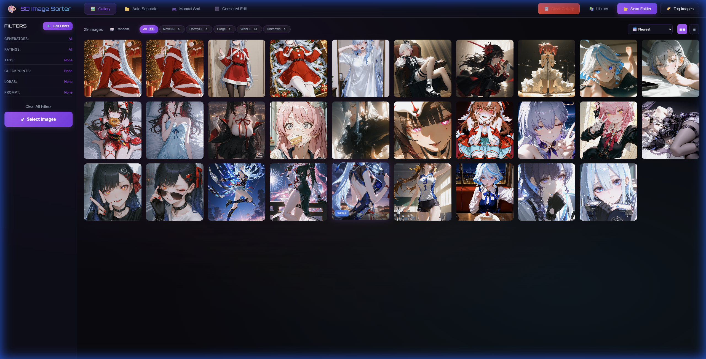
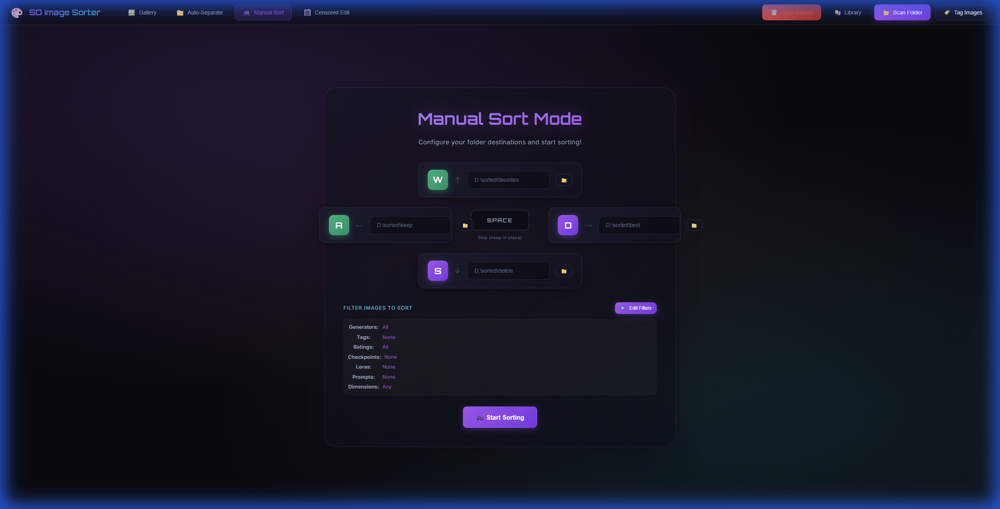
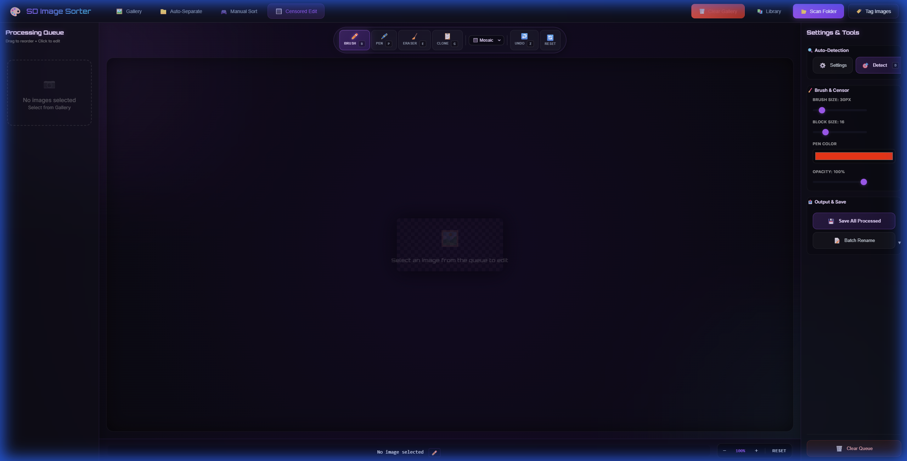
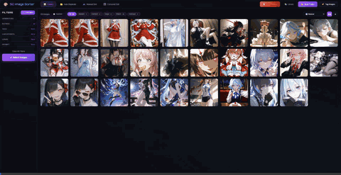

# SD Image Sorter (AI 图像筛选管理器)

[English](#english) | [简体中文](#简体中文)

---

<a name="english"></a>

<div align="center">

# 🎨 SD Image Sorter

**The all-in-one image manager for Stable Diffusion creators.**

Scan thousands of images. Auto-extract metadata. AI-tag everything.
Sort at lightning speed. Censor with precision. Find duplicates instantly.


[**Download for Windows**](https://github.com/peter119lee/sd-image-sorter/releases/latest) | [**Download for Linux/Mac**](https://github.com/peter119lee/sd-image-sorter/releases/latest)

</div>

---

### 🤔 Sound familiar?

> - 😵 Tons of images — some have metadata, some don't, can't tell them apart
> - 🔍 Want to filter by tags / prompts / models, but nothing does it well
> - 📚 Want a local tag/prompt library built from YOUR images
> - 🔳 Auto-censor always misjudges, and you can't manually fix it
> - 🧹 Need to batch-strip metadata or selectively keep it
>
> **Give this a try! 🍜**

| Gallery View | Manual Sort | Censor Edit |
|:------------:|:-----------:|:-----------:|
|  |  |  |

| Gallery Navigation | Manual Sort Flow |
|:------------------:|:----------------:|
|  |  |

---

## ⬇️ Download & Run

### Windows — extract and double-click

1. Download **[sd-image-sorter-v2.2.0-windows-portable.zip](https://github.com/peter119lee/sd-image-sorter/releases/latest)**
2. Extract to any folder
3. Double-click **`run-portable.bat`**

Python is included. AI models download automatically on first use.

### Linux / macOS

1. Download **[sd-image-sorter-v2.2.0-linux-mac.tar.gz](https://github.com/peter119lee/sd-image-sorter/releases/latest)**
2. `tar xzf sd-image-sorter-*.tar.gz && cd sd-image-sorter`
3. `chmod +x run.sh && ./run.sh`

Requires Python 3.9+. Virtualenv created automatically.

### From source

```bash
git clone https://github.com/peter119lee/sd-image-sorter.git && cd sd-image-sorter
# Windows: run.bat | Linux/Mac: ./run.sh
```

> App runs at **http://localhost:8487**. Models are NOT included (copyright) — they auto-download on first use (~500 MB).

---

## 🌐 China Mainland / 大陆镜像

```env
# Add to backend/.env
HF_ENDPOINT=https://hf-mirror.com
```

Artist ID & SAM3 also support [ModelScope](https://modelscope.cn) — select it in the UI.

---

## ✨ Features

<details open>
<summary><b>🖼️ Gallery</b> — scan, filter, sort your image library</summary>

- Auto-detect ComfyUI, NovelAI, WebUI/Forge metadata
- Extract prompts, settings, checkpoints, LoRAs
- Filter by generator, tags, ratings, checkpoints, LoRAs, prompts, dimensions
- Sort by date, name, prompt length, tag count, rating
</details>

<details>
<summary><b>🏷️ AI Tagging (WD14)</b> — auto-tag with anime/art tags</summary>

- Models: EVA02-Large, SwinV2, ConvNeXt, ViT
- Dual thresholds for general vs. character tags
- Auto rating: General / Sensitive / Questionable / Explicit
</details>

<details>
<summary><b>📁 Sorting</b> — Auto-Separate + WASD keyboard sort</summary>

- **Auto-Separate**: Bulk move by filter
- **Manual Sort**: WASD keys — like a game
- **Undo**: Instant revert
</details>

<details>
<summary><b>🔳 Censor Edit</b> — AI detect + manual touch-up</summary>

- Multi-model: Wenaka YOLO, NudeNet v3, both
- Styles: Mosaic, blur, black/white bar
- Tools: Brush, pen, eraser, clone stamp, SAM3 (GPU)
- Batch queue with rename & save
</details>

<details>
<summary><b>🔍 Similar Images</b> — CLIP visual search & dedup</summary>

- Find similar images by visual content
- Upload any image to search
- Near-duplicate detection
</details>

<details>
<summary><b>🧪 Prompt Lab</b> — random prompt generator</summary>

- Smart tag selection with exclusion rules
- Pre-built outfit sets
- Category browser
</details>

<details>
<summary><b>🎨 Artist ID</b> — identify style (experimental)</summary>

- Kaloscope2.0 classification
- Batch processing
- Filter by artist
</details>

---

## 🧰 Hardware

| Feature | RAM | GPU |
|:--------|:----|:----|
| Gallery, Sort, Prompt Lab | 4 GB | — |
| WD14 Tagging | 8–16 GB | Optional |
| Censor (Wenaka/NudeNet) | 8 GB | Optional |
| Similar (CLIP) | 8 GB | — |
| Artist ID (Kaloscope) | 16 GB | Recommended |
| SAM3 | 16 GB | **Required** (CUDA) |

---

## ⌨️ Shortcuts

| Context | Keys | Action |
|:--------|:-----|:-------|
| **Sort** | `W/A/S/D` | Move to folder |
| | `Space` | Skip |
| | `Z` | Undo |
| **Censor** | `B/P/E/G` | Brush/Pen/Eraser/Clone |
| | `[` `]` | Brush size |
| | `Ctrl+Z` | Undo |

---

## 🙏 Credits

| | |
|:--|:--|
| **[Antigravity](https://github.com/peter119lee)** & **Claude** | Core development |
| **[Wenaka2004](https://github.com/Wenaka2004/auto-censor)** | Censor inspiration & [YOLO model](https://civitai.com/models/1736285) |
| **[Spawner1145](https://github.com/spawner1145/comfyui-lsnet)** | LSNet artist identification |
| **[SmilingWolf](https://huggingface.co/SmilingWolf)** | WD14 Tagger models |
| **[Receyuki](https://github.com/receyuki/stable-diffusion-prompt-reader)** | Prompt reader inspiration |

📄 **License**: MIT — [LICENSE](LICENSE)

---

<br>

<a name="简体中文"></a>

<div align="center">

# 🎨 SD Image Sorter (AI 图像筛选管理器)

**Stable Diffusion 创作者的全能图像管理工具。**

扫描海量图片。自动提取元数据。AI 一键打标。
极速排序分类。精准打码修图。秒找重复图片。

[**下载 Windows 版**](https://github.com/peter119lee/sd-image-sorter/releases/latest) | [**下载 Linux/Mac 版**](https://github.com/peter119lee/sd-image-sorter/releases/latest)

</div>

---

### 🤔 你是不是正在烦恼...

> - 😵 一堆图片有些有元数据、有些没有，分不清
> - 🔍 想按 tags / prompts / 模型筛选，现有工具做不到
> - 📚 想从自己的图库建立本地标签资料库
> - 🔳 自动打码总是误判，又不能手动修
> - 🧹 想批量清元数据，或打码后选择性保留
>
> **来试试吧！🍜**

---

## ⬇️ 下载安装

### Windows — 解压双击就能用

1. 下载 **[sd-image-sorter-v2.2.0-windows-portable.zip](https://github.com/peter119lee/sd-image-sorter/releases/latest)**
2. 解压到任意文件夹
3. 双击 **`run-portable.bat`**

内置 Python，无需安装。AI 模型首次使用自动下载。

### Linux / macOS

1. 下载 **[sd-image-sorter-v2.2.0-linux-mac.tar.gz](https://github.com/peter119lee/sd-image-sorter/releases/latest)**
2. `tar xzf sd-image-sorter-*.tar.gz && cd sd-image-sorter`
3. `chmod +x run.sh && ./run.sh`

需要 Python 3.9+，脚本自动建虚拟环境。

### 从源码

```bash
git clone https://github.com/peter119lee/sd-image-sorter.git && cd sd-image-sorter
# Windows: run.bat | Linux/Mac: ./run.sh
```

> 程序运行在 **http://localhost:8487**。模型不包含在包里（版权），首次使用自动下载（约 500 MB）。

---

## 🌐 大陆镜像

```env
# 写到 backend/.env
HF_ENDPOINT=https://hf-mirror.com
```

画师识别和 SAM3 还支持 [ModelScope](https://modelscope.cn) — 在界面里选。

---

## ✨ 功能

<details open>
<summary><b>🖼️ 画廊</b> — 扫描、筛选、排序图库</summary>

- 自动识别 ComfyUI, NovelAI, WebUI/Forge
- 提取提示词、参数、模型、LoRA
- 按生成器、标签、评级、模型、LoRA、尺寸筛选
- 按时间、提示词长度、标签密度、评级排序
</details>

<details>
<summary><b>🏷️ AI 打标 (WD14)</b></summary>

- 多模型：EVA02-Large, SwinV2, ConvNeXt, ViT
- 通用标签和角色标签双阈值
- 自动评级：General / Sensitive / Questionable / Explicit
</details>

<details>
<summary><b>📁 排序</b> — 自动分类 + WASD 手动排</summary>

- **自动分类**: 按条件批量移动
- **手动排序**: WASD 键位，像打游戏
- **撤销**: 随时撤
</details>

<details>
<summary><b>🔳 打码编辑</b> — AI 检测 + 手动精修</summary>

- 多模型：Wenaka YOLO, NudeNet v3
- 风格：马赛克、模糊、黑条、白条
- 工具：画笔、橡皮擦、仿制图章、SAM3（需 GPU）
- 批量队列，重命名 + 保存
</details>

<details>
<summary><b>🔍 相似图片</b> — CLIP 视觉搜索</summary>

- 视觉相似搜索 + 重复检测
- 上传图片搜索图库
</details>

<details>
<summary><b>🧪 提示词工坊</b></summary>

- 智能标签选择 + 排除规则
- 预设服装套装
- 分类浏览
</details>

<details>
<summary><b>🎨 画师识别</b>（实验性）</summary>

- Kaloscope2.0 分类
- 批量处理
- 按画师筛选
</details>

---

## 🧰 硬件

| 功能 | 内存 | GPU |
|:-----|:-----|:----|
| 画廊、排序、提示词 | 4 GB | — |
| WD14 打标 | 8–16 GB | 可选 |
| 打码 | 8 GB | 可选 |
| 相似图 (CLIP) | 8 GB | — |
| 画师识别 | 16 GB | 建议 |
| SAM3 | 16 GB | **必须** (CUDA) |

---

## ⌨️ 快捷键

| 场景 | 按键 | 动作 |
|:-----|:-----|:-----|
| **排序** | `W/A/S/D` | 移到文件夹 |
| | `空格` | 跳过 |
| | `Z` | 撤销 |
| **打码** | `B/P/E/G` | 画笔/铅笔/橡皮/仿制 |
| | `[` `]` | 笔触大小 |
| | `Ctrl+Z` | 撤销 |

---

📄 **开源协议**: MIT — [LICENSE](LICENSE)

---

*Made with ❤️ for the Stable Diffusion community*

---

## ⬇️ Download & Install

### Windows — Just extract and run

Download **[sd-image-sorter-v2.2.0-windows-portable.zip](https://github.com/peter119lee/sd-image-sorter/releases/latest)** from GitHub Releases.

```
1. Extract the .zip to any folder
2. Double-click  run-portable.bat
3. Browser opens http://localhost:8000 — done!
```

Python is included. No install needed. AI models download automatically on first use (~500 MB).

### Linux / macOS

Download **[sd-image-sorter-v2.2.0-linux-mac.tar.gz](https://github.com/peter119lee/sd-image-sorter/releases/latest)** from GitHub Releases.

```bash
tar xzf sd-image-sorter-v2.2.0-linux-mac.tar.gz
cd sd-image-sorter
chmod +x run.sh && ./run.sh
```

Requires Python 3.9+. The script auto-creates a virtualenv and installs dependencies.

### From source (developers)

```bash
git clone https://github.com/peter119lee/sd-image-sorter.git
cd sd-image-sorter
# Windows: run.bat | Linux/Mac: ./run.sh
```

---

## 🌐 Mainland China / 大陆用户

AI models download from HuggingFace by default. If you're behind the GFW, set a mirror before launching:

```bash
# Add to backend/.env  (or set as environment variable)
HF_ENDPOINT=https://hf-mirror.com
```

Artist ID and SAM3 also support [ModelScope](https://modelscope.cn) — select it in the UI.

| Source | Covers | Setup |
|:-------|:-------|:------|
| **HuggingFace** | Everything | Default, no config |
| **hf-mirror** | Everything | `HF_ENDPOINT=https://hf-mirror.com` |
| **ModelScope** | Artist ID, SAM3 | Select in UI |

---

## ✨ Features

<details>
<summary><b>🖼️ Gallery Management</b> — scan, filter, sort your image library</summary>

- **Multi-source**: ComfyUI, NovelAI, WebUI/Forge auto-detected
- **Metadata extraction**: Prompts, settings, checkpoints, LoRAs
- **Advanced filtering**: By generator, tags, ratings, checkpoints, LoRAs, prompts, dimensions
- **Smart sorting**: By date, name, prompt length, tag count, rating
</details>

<details>
<summary><b>🏷️ AI Tagging (WD14)</b> — auto-tag images with anime/art tags</summary>

- **Multiple models**: EVA02-Large, SwinV2, ConvNeXt, ViT
- **Dual thresholds**: Separate sensitivity for general vs. character tags
- **Rating classification**: General / Sensitive / Questionable / Explicit
</details>

<details>
<summary><b>📁 Sorting</b> — Auto-Separate + WASD manual sort</summary>

- **Auto-Separate**: Bulk move images matching filters to destination folders
- **Manual Sort**: Fast WASD keyboard sorting — like a game
- **Undo**: Instantly revert any action
</details>

<details>
<summary><b>🔳 Censor Edit</b> — AI detection + manual touch-up</summary>

- **Multi-model**: Wenaka YOLO, NudeNet v3, or both
- **Styles**: Mosaic, blur, black bar, white bar
- **Tools**: Brush, pen, eraser, clone stamp, SAM3 text-prompt (GPU)
- **Batch**: Queue-based workflow with batch save and rename
</details>

<details>
<summary><b>🔍 Similar Images</b> — CLIP-based visual search</summary>

- Find visually similar images and near-duplicates
- Upload any image to search your library
- Local-first CLIP model, adjustable threshold
</details>

<details>
<summary><b>🧪 Prompt Lab</b> — random prompt generator</summary>

- Intelligent tag selection with exclusion rules
- Pre-built outfit tag sets
- Category browser for your library's tags
- Auto negative prompt generation
</details>

<details>
<summary><b>🎨 Artist ID</b> — identify artist/style (experimental)</summary>

- Kaloscope2.0 LSNet classification
- Batch processing with confidence threshold
- Filter gallery by identified artist
</details>

---

## 🧰 Hardware

| Feature | Min RAM | GPU needed? |
|:--------|:--------|:------------|
| Gallery, Sort, Prompt Lab | 4 GB | No |
| WD14 tagging (SwinV2) | 8 GB | Optional |
| WD14 tagging (EVA02-Large) | 16 GB | Optional |
| Censor (Wenaka/NudeNet) | 8 GB | Optional |
| Similar (CLIP) | 8 GB | No |
| Artist ID (Kaloscope) | 16 GB | Recommended |
| SAM3 refinement | 16 GB | **Required** (CUDA) |

<details>
<summary>Model sizes (auto-downloaded on first use)</summary>

| Model | Size |
|:------|:-----|
| `wd-swinv2-tagger-v3` | ~446 MB |
| `wd-eva02-large-tagger-v3` | ~1.2 GB |
| `Qdrant-clip-ViT-B-32-vision` | ~335 MB |
| `wenaka_yolov8s-seg.onnx` | ~46 MB |
| `NudeNet 320n.onnx` | ~12 MB |
| `Kaloscope2.0` | ~2.8 GB |
| `SAM3` | ~3.3 GB |
</details>

---

## 🛠️ Troubleshooting

<details>
<summary><b>Images don't show after scanning</b></summary>

- Use absolute paths (e.g. `D:\Images`)
- Supported: PNG / JPG / JPEG / WebP / GIF / BMP
- Check terminal for error messages
</details>

<details>
<summary><b>Tagging is slow</b></summary>

- First run downloads the model (~500 MB)
- GPU acceleration requires CUDA
- Use `wd-swinv2-tagger-v3` (lighter) instead of EVA02
</details>

<details>
<summary><b>Similar search returns empty</b></summary>

- Click **Generate Embeddings** in the Similar tab first
- Check the status banner at the top of the tab
</details>

<details>
<summary><b>Censor detection finds nothing</b></summary>

- Check the Censor tab banner
- Keep **Model Type** on `both` for best results
- Leave legacy model path blank (auto-selects Wenaka)
</details>

<details>
<summary><b>Artist ID returns "undefined"</b></summary>

- Experimental feature, respects confidence threshold
- Check Artist tab banner for runtime status
- Windows: install `triton-windows`
- Requires LSNet runtime (`comfyui-lsnet`)
</details>

---

## ⌨️ Keyboard Shortcuts

| Context | Keys | Action |
|:--------|:-----|:-------|
| **Manual Sort** | `W/A/S/D` | Move to assigned folder |
| | `Space` | Skip |
| | `Z` | Undo |
| **Censor Edit** | `A/D` | Previous / Next image |
| | `B` / `P` / `E` / `G` | Brush / Pen / Eraser / Clone |
| | `[` / `]` | Brush size |
| | `Ctrl+Z` | Undo stroke |
| | `Ctrl+Scroll` | Zoom |

---

## 🙏 Special Thanks

| Contributor | Contribution |
|:------------|:-------------|
| **[Antigravity](https://github.com/peter119lee)** & **Claude Opus 4.5** | Core development & AI-assisted coding |
| **[Wenaka2004](https://github.com/Wenaka2004/auto-censor)** | Auto-censor inspiration & [YOLO model](https://civitai.com/models/1736285) |
| **[Spawner1145](https://github.com/spawner1145/comfyui-lsnet)**, **DraconicDragon**, **heathcliff01** | LSNet artist identification |
| **[SmilingWolf](https://huggingface.co/SmilingWolf/wd-eva02-large-tagger-v3)** | WD14 Tagger models |
| **[Receyuki](https://github.com/receyuki/stable-diffusion-prompt-reader)** | Prompt reader inspiration |

## 📄 License

MIT License — see [LICENSE](LICENSE).

---

<br>

<a name="简体中文"></a>

# 🎨 SD Image Sorter (AI 图像筛选管理器)

专为 Stable Diffusion 用户打造的图像管理工具。自动提取元数据、AI 打标、智能过滤、极速排序。

---

## ⬇️ 下载安装

### Windows — 解压即用

从 GitHub Releases 下载 **[sd-image-sorter-v2.2.0-windows-portable.zip](https://github.com/peter119lee/sd-image-sorter/releases/latest)**

```
1. 解压到任意文件夹
2. 双击 run-portable.bat
3. 浏览器自动打开 http://localhost:8000 — 搞定！
```

内置 Python，无需安装。AI 模型首次使用时自动下载（约 500 MB）。

### Linux / macOS

从 GitHub Releases 下载 **[sd-image-sorter-v2.2.0-linux-mac.tar.gz](https://github.com/peter119lee/sd-image-sorter/releases/latest)**

```bash
tar xzf sd-image-sorter-v2.2.0-linux-mac.tar.gz
cd sd-image-sorter
chmod +x run.sh && ./run.sh
```

需要 Python 3.9+。脚本会自动创建虚拟环境并安装依赖。

### 从源码安装（开发者）

```bash
git clone https://github.com/peter119lee/sd-image-sorter.git
cd sd-image-sorter
# Windows: run.bat | Linux/Mac: ./run.sh
```

---

## 🌐 大陆用户镜像

模型默认从 HuggingFace 下载。大陆用户请在启动前设置镜像：

```bash
# 写到 backend/.env 文件里（或者设为环境变量）
HF_ENDPOINT=https://hf-mirror.com
```

画师识别和 SAM3 还支持 [ModelScope](https://modelscope.cn) — 在界面里选择即可。

| 来源 | 覆盖功能 | 设置方法 |
|:-----|:---------|:---------|
| **HuggingFace** | 全部 | 默认，不用设置 |
| **hf-mirror** | 全部 | `HF_ENDPOINT=https://hf-mirror.com` |
| **ModelScope** | 画师识别、SAM3 | 在界面里选 |

---

## ✨ 功能特性

<details>
<summary><b>🖼️ 画廊管理</b> — 扫描、筛选、排序你的图库</summary>

- **全面兼容**: ComfyUI, NovelAI, WebUI/Forge 自动识别
- **深度解析**: 提示词、采样参数、模型、LoRA 全部提取
- **精准过滤**: 按生成器、标签、评级、模型、LoRA、尺寸筛选
- **智能排序**: 按时间、提示词长度、标签密度、评级排序
</details>

<details>
<summary><b>🏷️ AI 打标 (WD14)</b> — 自动标注图片标签</summary>

- **多模型**: EVA02-Large, SwinV2, ConvNeXt, ViT
- **双重阈值**: 通用标签和角色标签分开设置
- **安全评级**: General / Sensitive / Questionable / Explicit
</details>

<details>
<summary><b>📁 排序</b> — 自动分类 + WASD 手动排序</summary>

- **自动分类**: 按过滤条件批量移动图片
- **手动排序**: WASD 键位操作，像打游戏一样快
- **撤销**: 随时撤销操作
</details>

<details>
<summary><b>🔳 打码编辑</b> — AI 检测 + 手动精修</summary>

- **多模型**: Wenaka YOLO、NudeNet v3，或两者并用
- **多种风格**: 马赛克、模糊、黑条、白条
- **精修工具**: 画笔、橡皮擦、仿制图章、SAM3 文本提示（需 GPU）
- **批量处理**: 队列化工作流，批量重命名与保存
</details>

<details>
<summary><b>🔍 相似图片</b> — CLIP 视觉搜索</summary>

- 查找视觉相似图片和近似重复
- 上传图片搜索你的图库
- 本地 CLIP 模型，可调阈值
</details>

<details>
<summary><b>🧪 提示词工坊</b> — 随机提示词生成</summary>

- 智能标签选择，自动排除冲突
- 预设服装标签套装
- 分类浏览图库标签
- 自动负向提示词
</details>

<details>
<summary><b>🎨 画师识别</b> — 识别画师/风格（实验性）</summary>

- Kaloscope2.0 LSNet 分类
- 批量处理，置信度阈值
- 按画师过滤图库
</details>

---

## 🧰 硬件要求

| 功能 | 最低内存 | 需要 GPU？ |
|:-----|:---------|:-----------|
| 画廊、排序、提示词工坊 | 4 GB | 不需要 |
| WD14 打标 (SwinV2) | 8 GB | 可选 |
| WD14 打标 (EVA02-Large) | 16 GB | 可选 |
| 打码 (Wenaka/NudeNet) | 8 GB | 可选 |
| 相似图片 (CLIP) | 8 GB | 不需要 |
| 画师识别 (Kaloscope) | 16 GB | 建议有 |
| SAM3 精修 | 16 GB | **必须** (CUDA) |

<details>
<summary>模型体积（首次使用自动下载）</summary>

| 模型 | 大小 |
|:-----|:-----|
| `wd-swinv2-tagger-v3` | 约 446 MB |
| `wd-eva02-large-tagger-v3` | 约 1.2 GB |
| `Qdrant-clip-ViT-B-32-vision` | 约 335 MB |
| `wenaka_yolov8s-seg.onnx` | 约 46 MB |
| `NudeNet 320n.onnx` | 约 12 MB |
| `Kaloscope2.0` | 约 2.8 GB |
| `SAM3` | 约 3.3 GB |
</details>

---

## 🛠️ 故障排查

<details>
<summary><b>扫描后图片没有显示</b></summary>

- 使用绝对路径（例如 `D:\Images`）
- 支持：PNG / JPG / JPEG / WebP / GIF / BMP
- 查看终端错误信息
</details>

<details>
<summary><b>打标很慢</b></summary>

- 首次运行需要下载模型（约 500 MB）
- GPU 加速需要 CUDA
- 优先用 `wd-swinv2-tagger-v3`（更轻量）
</details>

<details>
<summary><b>相似搜索为空</b></summary>

- 先在 Similar 标签页点击 **Generate Embeddings**
- 检查标签页顶部状态条
</details>

<details>
<summary><b>打码检测不到东西</b></summary>

- 检查 Censor 标签页状态条
- Model Type 保持 `both`
- Legacy 模型路径留空（自动选 Wenaka）
</details>

<details>
<summary><b>画师识别一直是 undefined</b></summary>

- 实验性功能，受置信度阈值影响
- 检查 Artist 标签页状态条
- Windows 需要 `triton-windows`
- 需要 LSNet runtime（`comfyui-lsnet`）
</details>

---

## ⌨️ 快捷键

| 场景 | 按键 | 动作 |
|:-----|:-----|:-----|
| **手动排序** | `W/A/S/D` | 移动到指定文件夹 |
| | `空格` | 跳过 |
| | `Z` | 撤销 |
| **打码编辑** | `A/D` | 上/下一张 |
| | `B` / `P` / `E` / `G` | 画笔 / 铅笔 / 橡皮擦 / 仿制图章 |
| | `[` / `]` | 笔触大小 |
| | `Ctrl+Z` | 撤销 |
| | `Ctrl+滚轮` | 缩放 |

---

## 📄 开源协议

MIT License — 详见 [LICENSE](LICENSE)。

---

## 🙏 Special Thanks

| Contributor | Contribution |
|:------------|:-------------|
| **[Antigravity](https://github.com/peter119lee)** & **Claude Opus 4.5** | Core development & AI-assisted coding |
| **[Wenaka2004](https://github.com/Wenaka2004/auto-censor)** | Auto-censor inspiration & [YOLO model](https://civitai.com/models/1736285) |
| **[Spawner1145](https://github.com/spawner1145/comfyui-lsnet)**, **DraconicDragon**, **heathcliff01** | LSNet artist identification |
| **[SmilingWolf](https://huggingface.co/SmilingWolf/wd-eva02-large-tagger-v3)** | WD14 Tagger models |
| **[Receyuki](https://github.com/receyuki/stable-diffusion-prompt-reader)** | Prompt reader inspiration |

---

*Made with ❤️ for the Stable Diffusion community*
